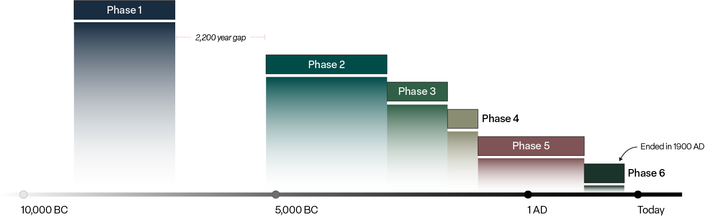

```{r setup, include=FALSE}
knitr::opts_chunk$set(echo = TRUE)
```

```{r packages, include=FALSE}

library(tidyverse)
library(htmlwidgets)
library(crosstalk)
library(leaflet)
library(ggiraph)
library(RColorBrewer)
```

<br>

*The section below was envisioned as an addition to [this NYT article](https://www.nytimes.com/2023/01/30/science/archaeology-bogs-mummies.html) about [new research](https://www.cambridge.org/core/journals/antiquity/article/bogs-bones-and-bodies-the-deposition-of-human-remains-in-northern-european-mires-9000-bcad-1900/B90A16A211894CB87906A7BCFC0B2FC7#) on mummified remains in European bogs.*

<br>

------------------------------------------------------------------------

### Unearthing insights {.tabset}

The study offers the first large-scale overview of well-dated human remains from northern European mires, with the principal goal to identify broad trends in frequency, location, and characteristics of finds. Researchers compiled a database consisting of 266 sites and more than 1,000 individuals. Using statistical modelling, they identified six major phases in history for this phenomenon. The main characteristics that distinguish each phase can be explored below.

<br>

{style="display: block; margin: 1em auto;" width="1000"}

<br>

<br>

#### Spatial

```{r echo=FALSE, message=FALSE, warning=FALSE}

# import csv for map
data_map <- read.csv("data/bog bodies data.csv")

# create shared data source for interactivity
shared_map <- SharedData$new(data_map)

# create a palette that maps phases to colors
pal1 <- colorFactor(c("red", "orange", "yellow", "green", "blue", "violet"),
                   domain = c(1:6)
                   )

pal2 <- colorFactor(c("#702632", "#682C49", "#583659", "#453E60", "#35445F", "#2F4858"),
                    domain = c(1:6)
                    )

pal3 <- colorFactor(c("#192D41", "#014C49", "#316046", "#8B8D72", "#805456", "#1A332B"),
                    domain = c(1:6)
                    )

# create map and filter within boostrap columns function
bscols(widths = c(1,4,7),
       "",
       ("The first sites appear in Denmark, southern Sweden and Norway. In phases 2 and 3, sites pop up in Ireland and the UK. The coverage area increases to include Germany, Poland, and the Baltic states in phase 5. In phase 6 a significant shift occurs from Denmark to Ireland and the UK."),
       list(leaflet(shared_map) %>%
             addProviderTiles(providers$Stamen.TonerLite, group = "Lite") %>%
             addProviderTiles(providers$Stamen.Terrain, group = "Terrain") %>%
             #addProviderTiles(providers$Esri.WorldImagery, group = "World Imagery") %>%
             addLayersControl(baseGroups = c("Lite", "Terrain")) %>%
             addCircleMarkers(label = data_map$location,
                              #fillColor = "darkgoldenrod",
                              #fillColor = ~pal1(phase),
                              #fillColor = ~pal2(phase),
                              fillColor = ~pal3(phase),
                              fillOpacity = 0.6,
                              stroke = TRUE,
                              color = "black",
                              weight = 1,
                              radius = 5) %>%
             setView(lat = 59.903689, lng = 10.746552, zoom = 3.5),
           filter_checkbox("phase", "Filter by phase", shared_map, 
                           ~phase, inline = TRUE, columns = 1)
       )
)
```

<br>

#### Preservation

```{r echo=FALSE, message=FALSE, warning=FALSE}

# import csv for preservation trends
data_preservation <- read.csv("data/trends_preservation.csv")

# create plot object
p1 <- ggplot(data = data_preservation,
             aes(x = phase, y = remains_count,
                 fill = remains_type,
                 data_id = remains_type
                 )
             ) +
  geom_col_interactive(aes(tooltip = sprintf("%s: %.0f", remains_type, remains_count)),
                       size = 0.25,
                       color = "gray15"
                       ) +
  labs(fill = "Type of remains",
       x = "Phase",
       y = "Count",
       title = "Type of remains by phase", 
       subtitle = "Hover over the bars for more details"
#      caption = "Hover over the bars for more details"
       ) +
  scale_x_discrete(limits = c(1, 2, 3, 4, 5, 6), breaks = c(1, 2, 3, 4, 5, 6)) +
  scale_fill_manual(values = c("gray30", "gray70")) +
  guides(fill = FALSE) +
# guides(fill = guide_legend(title = NULL)) +
  theme_minimal() +
  theme(
    panel.grid.major.x = element_blank(),
    panel.grid.minor.x = element_blank(),
    panel.grid.minor.y = element_blank(),
#   plot.caption = element_text(hjust = 0)
    )
#   annotate("text", x = 1.5, y = 165, label = "Hover over bars for more details",
#           size = 3, fontface = "italic")

# use bootstrap columns to call text and chart
bscols(widths = c(1,4,7),
       "",
       ("Phase 1 and 2 sites yielded only bog skeletons. The first bog mummies don't appear until later, in phases 3 and 4, with just five bog mummies from before 1,000 BC. Phase 5 features a far larger number of bog mummies, although they still represent fewer than half of cases. The balance completely shifts in phase 6."),
       girafe(ggobj = p1,
              options = list(opts_sizing(rescale = TRUE, width = 1))
              )
       )
```

<br>

#### Age

```{r age, echo=FALSE, message=FALSE, warning=FALSE}

# import csv for age trends
data_age <- read.csv("data/trends_age.csv")

# create plot object
p2 <- ggplot(data = data_age,
             aes(x = phase, y = age_count,
                 fill = age_type,
                 data_id = age_type
                 )
             ) +
  geom_col_interactive(aes(tooltip = sprintf("%s: %.0f", age_type, age_count)),
                       size = 0.25,
                       color = "gray15",
                       position = position_stack(reverse = TRUE)
                       ) +
  labs(fill = "Age group",
       x = "Phase",
       y = "Count",
       title = "Age of individuals by phase", 
       subtitle = "Hover over the bars for more details"
       ) +
  scale_x_discrete(limits = c(1, 2, 3, 4, 5, 6), breaks = c(1, 2, 3, 4, 5, 6)) +
  scale_fill_manual(values = c("gray70", "gray30")) +
# scale_fill_manual(labels = c("children", "adults"), values = c("gray30", "gray70")) +
  guides(fill = FALSE) +
# guides(fill = guide_legend(title = NULL)) +
  theme_minimal() +
  theme(
    panel.grid.major.x = element_blank(),
    panel.grid.minor.x = element_blank(),
    panel.grid.minor.y = element_blank()
  )

# use bootstrap columns to call text and chart
bscols(widths = c(1,4,7),
       "",
       ("Adults are most common throughout all phases. Children are present to a lesser degree in each phase, though missing entirely from phase 4. The age for 26 individuals could not be determined or is otherwise unknown."),
       girafe(ggobj = p2,
              options = list(opts_sizing(rescale = TRUE, width = 1))
              )
       )
```

<br>

#### Sex

```{r sex_v2, echo=FALSE, message=FALSE, warning=FALSE}

# import csv for sex trends
data_sex <- read.csv("data/trends_sex.csv")

# create plot object
p3 <- ggplot(data = data_sex,
             aes(x = phase, y = sex_count,
                 fill = sex_type,
                 data_id = sex_type
                 )
             ) +
  geom_col_interactive(aes(tooltip = sprintf("%s: %.0f", sex_type, sex_count)),
                       size = 0.25,
                       color = "gray15"
                       ) +
  labs(fill = "Sex",
       x = "Phase",
       y = "Count",
       title = "Sex of individuals by phase", 
       subtitle = "Hover over the bars for more details"       
       ) +
  scale_x_discrete(limits = c(1, 2, 3, 4, 5, 6), breaks = c(1, 2, 3, 4, 5, 6)) +
  scale_fill_manual(values = c("gray30", "gray70")) +
  guides(fill = FALSE) +
# guides(fill = guide_legend(title = NULL)) +
  theme_minimal() +
  theme(
    panel.grid.major.x = element_blank(),
    panel.grid.minor.x = element_blank(),
    panel.grid.minor.y = element_blank()
  )

# use bootstrap columns to call text and chart
bscols(widths = c(1,4,7),
       "",
       ("Males form the largest group in most phases. However, in phases 2 and 4 the balance is almost equal between males and females. The sex of 89 individuals could not be determined or is otherwise unknown."),
       girafe(ggobj = p3,
              options = list(opts_sizing(rescale = TRUE, width = 1))
              )
       )

```

<br>

#### Cause of Death

```{r death, echo=FALSE, message=FALSE, warning=FALSE}

# import csv for cause of death trends
data_death <- read.csv("data/trends_death.csv")

# create plot object
p4 <- ggplot(data = data_death,
             aes(x = phase, y = death_count,
                 fill = death_type,
                 data_id = death_type
                 )
             ) +
  geom_col_interactive(aes(tooltip = sprintf("%s: %.0f", death_type, death_count)),
                       size = 0.25,
                       color = "gray15"
                       ) +
  labs(fill = "Cause of death",
       x = "Phase",
       y = "Count",
       title = "Cause of death by phase", 
       subtitle = "Hover over the bars for more details"
       ) +
  scale_x_discrete(limits = c(1, 2, 3, 4, 5, 6), breaks = c(1, 2, 3, 4, 5, 6)) +
  scale_fill_brewer(palette = "Greys", direction = -1) +
  guides(fill = FALSE) +
# guides(fill = guide_legend(title = NULL)) +
  theme_minimal() +
  theme(
    panel.grid.major.x = element_blank(),
    panel.grid.minor.x = element_blank(),
    panel.grid.minor.y = element_blank()
  )

# use bootstrap columns to call text and chart
bscols(widths = c(1,4,7),
       "",
       ("Cause of death is established for 57 individuals. In 45 cases, violence was involved, featuring in all phases except for phase 1. The highest proportions of violent deaths appear in phases 2 and 6. Evidence of violence appears to be less frequent in phase 4. In rare cases, only occurring in phase 5, disease is the probable cause of death. Phase 6 includes six suicide victims and four cases of accidental death (e.g. drowning)."),
       girafe(ggobj = p4,
              options = list(opts_sizing(rescale = TRUE, width = 1))
              )
       )
```

<br>

#### Violence

```{r violence, echo=FALSE, message=FALSE, warning=FALSE}

# import csv for violence breakdown
data_violence <- read.csv("data/trends_violence.csv")

# create plot object
p5 <- ggplot(data = data_violence,
             aes(x = phase, y = violence_count,
                 fill = violence_type,
                 data_id = violence_type
                 )
             ) +
  geom_col_interactive(aes(tooltip = sprintf("%s: %.0f", violence_type, violence_count)),
                       size = 0.25,
                       color = "gray15"
                       ) +
  labs(fill = "Type of violence",
       x = "Phase",
       y = "Count",
       title = "Type of violence by phase", 
       subtitle = "Hover over the bars for more details"
       ) +
  scale_x_discrete(limits = c(1, 2, 3, 4, 5, 6), breaks = c(1, 2, 3, 4, 5, 6)) +
  scale_fill_brewer(palette = "Greys", direction = -1) +
  guides(fill = FALSE) +
# guides(fill = guide_legend(title = NULL)) +
  theme_minimal() +
  theme(
    panel.grid.major.x = element_blank(),
    panel.grid.minor.x = element_blank(),
    panel.grid.minor.y = element_blank()
  )

# use bootstrap columns to call text and chart
bscols(widths = c(1,4,7),
       "",
       ("The 45 individuals exhibiting evidence of a violent death can be further categorized. Head trauma is the leading violent cause of death and present in every phase. Stabbed and hanged individuals are tied for the second leading cause of violent death, and both show a strong presence in phase 5. Some individuals, mainly in phase 5, show signs of excessive violence, or overkill, with multiple potential causes of death. These are generally considered to be ritualistic offerings, though ritual and violent acts can be variously entangled, such as 'war-booty' sites."),
       girafe(ggobj = p5,
              options = list(opts_sizing(rescale = TRUE, width = 1))
              )
       )
```

<br>

#### Study Impact

This approach shows that widening the study's focus to encompass a larger study region, longer timeframe, the incorporation of bog mummies as well as bog skeletons, and the inclusion of both radiocarbon and historical dating evidence, permits new trends to come to light. The full database, freely available [here](https://www.cambridge.org/core/journals/antiquity/article/bogs-bones-and-bodies-the-deposition-of-human-remains-in-northern-european-mires-9000-bcad-1900/B90A16A211894CB87906A7BCFC0B2FC7#supplementary-materials), offers great potential for the recognition of other trends and for further study.

###  {.unnumbered}

<br>
